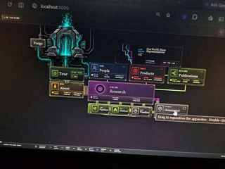
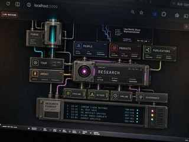
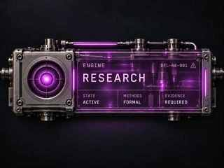

# BFL Web Backlog — Lab Machine UI: Forge, Research Engine, Research Exhaust

**Workstream:** 28 — Lab Machine Physical UI Refinement v0.1  
**Status:** Design-ready / implementation open  
**Target:** Boundary First Labs public web / Lab Machine apparatus  
**Priority:** High

## 0. Repository integration

This is a new implementation workstream, not a new visual doctrine. It extends existing Lab Machine machinery.

- **19 — Apparatus Landing:** preserve the restraint rule: **physical hierarchy over mechanical density**. This workstream targets the darker Lab Machine projection, not the separate beige institutional landing prototype.
- **23 — Lab Machine Governed Object Registry:** `visual_grammar_v0_1.md` is an upstream visual/interaction invariant. Every physical metaphor should communicate an operational distinction.
- **11 — BFL Live Research System UX:** preferred conceptual/data-source family for future Research Exhaust events. Keep Exhaust adapter-driven rather than coupling presentation to one registry.

Before implementation, inspect the current Lab Machine/entrance components and nearest local specs. The images here are requirements evidence, not a substitute for current-source inspection.

## 1. Feature intent

The Lab Machine should increasingly read as an **apparatus**, not a collection of cards.

> **Cards describe the lab. Machines do the lab.**

This workstream defines three connected elements:

1. **Forge** — making/fabrication machine.
2. **Research Engine** — central processing core for inquiry.
3. **Research Exhaust** — live telemetry showing that research work is occurring.

They should share a coherent physical/digital language while remaining restrained enough for a serious research institution.

## 2. Visual references


**Figure 0 — Baseline.** Preserve existing information architecture, color identities, and apparatus topology unless explicitly changed below.



**Figure 1 — Forge.** Installed above Tour; the graphic itself is the element, not a card.


**Figure 2 — Exhaust.** Long, shallow, hardware-like output device below Research.



**Figure 3 — Overall refinement target.** Less game-like: lower bloom, fewer ornamental details, cleaner surfaces, restrained physical realism.



**Figure 4 — Research material target.** Smoked/radiant purple plexiglass held by machined metal edges/corners; purple is soft and diffused, not a neon game prop.

## 3. Shared design grammar

### Physical grounding

Use metal plates, rails, brackets, clamps, fasteners, seams, conduits, ports, mounts, smoked/translucent plexiglass, inset displays, embedded labels, and restrained indicators. Cable/conduit relationships should correspond to actual dependencies.

Avoid free-floating labels, decorative sci-fi protrusions, excessive bevel/bloom/haze, ornamental vents, or game-HUD treatment. Structure should feel precise and maintained rather than distressed or retro-futurist.

### Labels

Labels/signage must appear physically integrated: bolted plates, stamped/engraved headers, industrial tags, inset status labels, indicator windows. Do not rely on detached atmospheric copy.

### Color

Semantic colors remain restrained signal channels: Forge cyan/teal; Research purple/magenta; Pipeline/Method/Timeline green/lime; Products red; People blue; About amber/yellow; Publications green. Research purple should read as **material under illumination**, not flat fill.

### Motion

Ambient and instrument-like only: slow code/data movement, occasional state changes, subtle conduit pulses, restrained ticker advance, slow contained core illumination. No particle storms, aggressive flashes, or constant high-energy pulsing. Honor `prefers-reduced-motion`.

## 4. Feature A — Forge

### Purpose

Represent fabrication: ideas, code, models, infrastructure, and prototypes being formed into artifacts. It should be visually understandable before explanatory copy.

### Placement

**Required: directly above Tour.** Tour should read almost like the control/readout panel beneath the machine.

Do not place Forge inside a card, left of the entire apparatus as an isolated destination, under About, or as a floating hero illustration.

### Form

- standalone installed machine
- compact neo-brutalist cyber-industrial housing
- dark metal/gunmetal structure
- central cyan/teal digital chamber
- binary/matrix data replacing literal fire and steel
- minimal code/pixel exhaust or vapor
- plausible supports, ports, and conduits

Final implementation should be calmer and simpler than the concept-art versions.

### Label/interaction

Use a small physically attached **FORGE** plate. Optional microcopy may include `MATTER → MEANING` if useful. Hover/focus may softly energize conduits, code, or a tiny `READY`/`ACTIVE` indicator. Do not use a conventional card-hover box.

### Acceptance

- Forge above Tour at desktop scale.
- No enclosing conventional card.
- Digital fabrication metaphor legible at a glance.
- Binary/data is the active material.
- Label and connections appear physically attached.
- Keyboard/focus treatment is subtle and accessible.
- Mobile preserves Forge→Tour relationship.

## 5. Feature B — Research Engine

### Purpose

Research is the **engine core** of the Lab Machine. It remains the central Research destination but becomes materially distinct from ordinary cards: a controlled processing chamber, not a decorative reactor.

### Material direction

- smoked/translucent purple plexiglass or acrylic
- machined metal bindings along edges
- reinforced metal corners and side rails
- subtle fasteners/mounting hardware
- visible but quiet interior depth
- restrained purple illumination

**Critical:** the purple inset is radiant but soft. Avoid extreme contrast, excessive sharpness, harsh bloom, or opaque flat-purple fill. It should feel like purple light diffusing through tinted transparent material.

### Structure

Preserve semantic text: `ENGINE`, `RESEARCH`, `STATE / ACTIVE`, `METHODS / FORMAL`, `EVIDENCE / REQUIRED`, optional `BFL-RE-001`. The left circular mark/core may remain as a contained lens/instrument port rather than a dramatic sci-fi reactor.

### Connectivity

Research visibly drives downstream machinery via ports/couplings to **Pipeline**, **Method**, **Timeline**, and a dedicated output to **Research Exhaust**. Connections should communicate causality, not decoration.

### Implementation posture

Prefer DOM/CSS/SVG over using the concept image as the production card. Keep semantic text real; build material effects from reusable primitives; make glow/transparency tunable; keep motion and responsive behavior accessible.

### Acceptance

- Research remains central.
- Main face clearly reads as tinted plexiglass/acrylic.
- Metal bindings visibly hold the transparent surface.
- Purple identity is soft and restrained.
- Existing labels remain semantic and legible.
- Internal depth exists without clutter.
- Downstream ports connect to Pipeline/Method/Timeline/Exhaust.
- Reduced-motion and small viewports remain usable.

## 6. Feature C — Research Exhaust

### Purpose

Visible evidence that the Research Engine is running. It exposes ambient machine telemetry without requiring visitors to navigate into internal registries. **It is machine output, not marketing copy.**

### Placement/form

Mount a long, shallow hardware device below Research / Pipeline / Method / Timeline, physically fed by Research.

Use a slim dark metal housing, simple rails/fasteners, inset display, restrained vents/indicators, attached plate, and visible input connection. Required label: **RESEARCH EXHAUST**. Secondary: `LIVE OUTPUT` or `STATUS FEED`.

### Event grammar

Normalize entries as `TIME · LANE · EVENT · OBJECT · STATE`.

```text
23:47 · CANTOR · CLAIM · recursive diagonal operator · REFINED
23:41 · NAVIER-STOKES · TEST · boundary closure case 04 · PASS
23:32 · DISTINCTION SPACE · ARTIFACT · note-017 · EMITTED
23:18 · ATLAS · INDEX · transforms +6 · COMPLETE
23:03 · SOURCE · ADMISSION · reference batch · ADMITTED
```

UI may abbreviate while retaining structured fields; optional stable codes such as `THM-043`, `ART-776`, `IDX-301` are useful.

Suggested contract:

```ts
export type ResearchExhaustEvent = {
  id: string;
  occurredAt: string;
  lane: string;
  eventType: 'claim' | 'test' | 'artifact' | 'index' | 'source' |
    'publication' | 'experiment' | 'status';
  object: string;
  state: string;
  shortCode?: string;
  href?: string;
  provenanceHref?: string;
  severity?: 'info' | 'active' | 'success' | 'warning' | 'defect';
};
```

### Data boundary

Ship first against static/generated JSON. Later adapters may derive packets from Research Lane Registry, Experiment Register, claim ledgers, artifact events, Atlas/indexing, source admission/rejection, publication state, or other durable registries/manifests. Presentation must not know domain internals.

### Interaction/state

Show a small number of recent events with slow advancement, not frantic terminal animation. Rows may link to an artifact/lane/claim/experiment/publication/provenance target. Color state minimally: neutral/cyan info; green complete/pass; amber active/warning; purple internal research; red defect/rejection.

Empty state should be deliberate (`IDLE`, `NO NEW OUTPUT`). Live-load failure falls back gracefully to last-known/static feed.

### Acceptance

- Physically connected to Research.
- Clearly an output device, not a navigation card.
- `RESEARCH EXHAUST` attached label.
- Normalized events and optional provenance links.
- Works with static JSON before backend instrumentation.
- Subtle/reduced motion.
- Keyboard and assistive-technology readable.
- Graceful empty/failure states.

## 7. Integrated apparatus semantics

```text
                 FORGE
                   │
                  TOUR
                   │
      PEOPLE ─── RESEARCH ─── PRODUCTS / PUBLICATIONS
                   │
          ┌────────┼────────┐
       PIPELINE   METHOD   TIMELINE
                   │
            RESEARCH EXHAUST
```

Conceptual reading: Forge — things are made. Research Engine — inquiry is processed. Pipeline / Method / Timeline — work is structured and moved. Research Exhaust — activity becomes visible telemetry. Publications — durable outputs leave the lab.

## 8. Responsive behavior

**Desktop:** preserve spatial/causal layout; Forge above Tour; Research central/wide; Exhaust below lower row.

**Tablet:** scale while preserving relationships; simplify conduits rather than overlapping content; Exhaust may become full-width beneath Research grouping.

**Mobile:** stack a machine sequence rather than preserving the entire graph: Forge → Tour/About → Research → Pipeline/Method/Timeline → Research Exhaust → supporting cards. Preserve ports/state/material grammar. Replace horizontal ticker overflow with line cycling or compact vertical events.

## 9. Accessibility and performance

- Keep machine text semantic where practical.
- Provide keyboard focus that fits the physical grammar.
- Never encode state only by color.
- Maintain contrast through translucent materials.
- Honor `prefers-reduced-motion`.
- Hide decorative internals from assistive technology.
- Give interactive feed events clear accessible labels/targets.
- Prefer CSS/SVG/DOM over large animated rasters.
- Use cheap transforms/opacity for continuous animation.
- Avoid many simultaneous blur/bloom layers.
- Lazy-load noncritical decorative media.

## 10. Implementation order

1. **Shared physical primitives** — metal bindings/corners, plexiglass, attached plates, ports/couplings, conduits, indicators, lens, restrained glow tokens.
2. **Research Engine** — reference implementation for the material grammar.
3. **Forge** — install above Tour with a compact custom silhouette.
4. **Research Exhaust static feed** — hardware + generated/static JSON.
5. **Research Exhaust adapter** — map durable lab events into normalized packets.
6. **Polish** — interaction, responsive behavior, accessibility, reduced motion, performance.

## 11. Definition of done

Done when the apparatus has an installed Forge above Tour; Research is a legible plexiglass-and-metal engine core; Exhaust provides believable normalized ambient telemetry below Research; all three share coherent physical grammar; the result is more machine-like while remaining sober; semantics/accessibility/performance are preserved; production UI is built from maintainable web primitives; and the Exhaust can later accept real lab events through an adapter boundary.

## 12. Priority summary

| Item | Priority | Requirement |
|---|---:|---|
| Shared physical UI primitives | P0 | metal / plexiglass / plate / conduit / port grammar |
| Research Engine refinement | P0 | soft purple smoked plexiglass + metal bindings |
| Forge machine | P0 | standalone machine above Tour; no card |
| Research Exhaust hardware | P0 | long shallow output device below Research |
| Exhaust event contract | P0 | normalized `TIME · LANE · EVENT · OBJECT · STATE` |
| Static/local adapter | P1 | ship UI before live machinery integration |
| Live lab-event adapter | P1 | durable sources mapped to packets |
| Interaction/motion | P1 | subtle grounded states; reduced motion |
| Responsive pass | P1 | preserve relationships across layouts |
| Accessibility/performance | P0 | semantic text, keyboard, contrast, low-cost effects |

## 13. Implementation principle

The concept images are material/hierarchy/relationship references, not pixel-perfect targets. Prioritize, in order: information architecture; causal machine relationships; semantic/accessibility correctness; restrained physical-material illusion; animation/spectacle.

The site should feel like a machine because its structure behaves like one—not because every surface glows.
