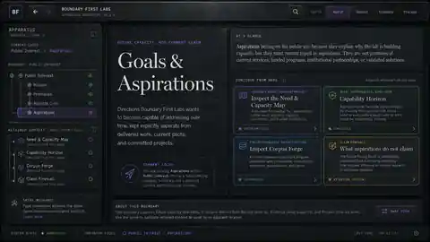
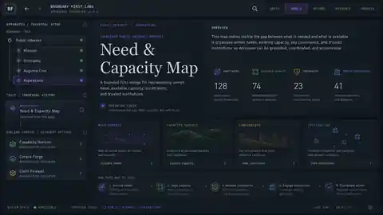
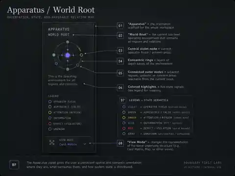
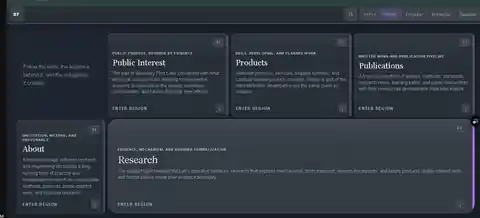
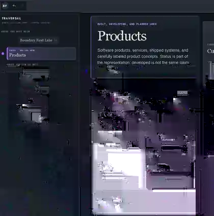
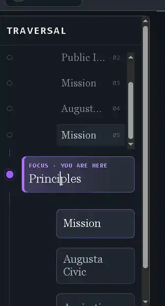

# Visual references

The images in this folder preserve the visual reasoning used during the August 2026 BF-UX traversal / apparatus pass.

They are **design evidence, not literal specifications**. Generated concepts contain illustrative details that must not be promoted into production semantics unless the application can support them truthfully.

All files here are optimized WebP archival previews derived from higher-resolution concept or screenshot sources used during the pass.

## Generated concepts

### Root apparatus


`concept_root_apparatus.webp`

This became the strongest overall visual reference for the entered World:

- compact top chassis;
- persistent traversal rail;
- five primary institutional regions;
- technical registers and serif region titles;
- thin semantic accenting rather than large saturated fills;
- status / utility bar language;
- bounded industrial workfield.

Important constraint: illustrative telemetry and footer controls in the concept are **not** canonical data. Counts and controls should only appear when backed by real state and handlers.

### Aspirations branch



`concept_aspirations_branch.webp`

This concept helped test whether the apparatus could remain coherent below the root. It contributed to the navigation discussion because it visually retained prior context while exposing nearby possibilities.

The later implementation deliberately simplified the rail beyond the concept: history, current focus, and peers are enough; child paths belong to the page.

### Need & Capacity leaf



`concept_need_capacity_leaf.webp`

This study explored a deeper leaf / working-instrument state. It was useful for:

- showing how a current subject can remain the main instrument;
- keeping typed actions and evidence visually subordinate;
- testing dense technical information inside the same material grammar.

Any numerical readouts shown in the generated concept are illustrative only unless connected to real data.

### Root interface anatomy



`concept_root_interface_map.webp`

This annotated study is useful as a morphology map rather than a finished screen. It separates chassis, traversal, workfield, region assemblies, and status / utility zones and helped turn the visual direction into reusable UI contracts.

## Implementation observations

These screenshots are not target designs. They are preserved because each exposed a defect that materially changed the implementation.

### Root World implementation snapshot



`implementation_root_world.webp`

A production-state reference from the Card renderer. This records the point where the apparatus grammar had moved into the actual public renderer instead of remaining isolated in the Apparatus prototype.

### Products branch — spatial-flow defect



`implementation_secondary_products_issue.webp`

This screenshot exposed two concrete problems:

1. the traversal chassis was consuming a large blank vertical region;
2. the Products title / subject panel was being treated as a tall left column rather than the horizontal title boundary for the complete page.

It directly motivated the desktop **top-first** layout:

```text
+---------------------------------------+
|             Products title            |
+---------------+-----------------------+
| At a glance   | contained regions     |
+---------------+-----------------------+
```

It also motivated content-sized navigation height with a bounded maximum.

### Traversal rail — indentation defect



`implementation_traversal_spacing_issue.webp`

After the first width reduction, this screenshot showed that the rail still spent too much horizontal space internally. The trace spine, focus card, and peer controls used separate nested offsets.

That observation led to the final geometry of this pass:

- rail width `clamp(196px, 15vw, 232px)`;
- one compact alignment column;
- spine closer to the chassis edge;
- reduced flow/header padding;
- no permanent scrollbar-gutter reservation.

## Reading these images

The concepts should be mined for **grammar**:

- visual hierarchy;
- bounded regions;
- relationships between structure and agency;
- typography and register hierarchy;
- interaction density;
- continuity of traversal.

They should not be mined uncritically for content, metrics, system state, or controls.

The implementation screenshots serve the opposite purpose: they preserve observed failures so future changes do not accidentally recreate them.
