# Boundary First UX
## Mermaid Diagrams and Wireframes v0.6
### Paired with `nodes_boundary_theory_reorganized_v0_3.json`

---

## 1. One content graph, multiple projections

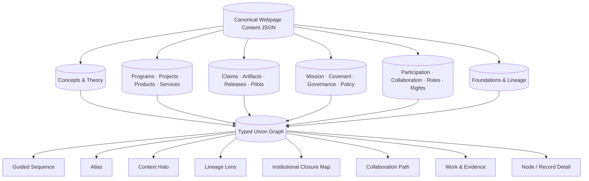

---

## 2. Navigation scales

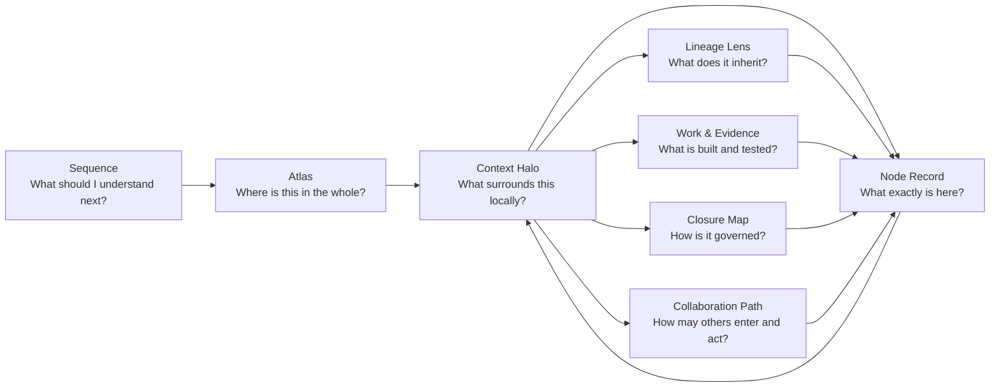

---

## 3. Revised first passage v0.6

```mermaid
flowchart LR
    S0[0 Problem]
    S1[1 Boundary First]
    S2[2 Roots]
    S3[3 Synthesis]
    S4[4 Lived Convergence]
    S5[5 On-Ramps]
    S6[6 Distinction Space]
    S7[7 Boundary Theory]
    S8[8 Representational Mechanics]
    S9[9 Choose a Path]
    S10[10 Work Takes Form]
    S11[11 Work Enters Relation]
    S12[12 Work Earns Promotion]
    S13[13 Institution Binds Itself]
    S14[14 Atlas Reveal]

    S0 --> S1 --> S2 --> S3 --> S4 --> S5 --> S6 --> S7 --> S8 --> S9 --> S10 --> S11 --> S12 --> S13 --> S14
```

### Scene 11 — Work enters relation

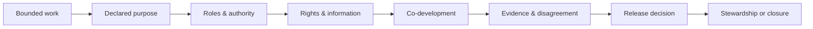

---

## 4. Institutional stage

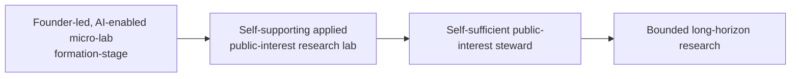

The long horizon is visually separated from current institutional capability.

---

## 5. Mission, method, and covenant

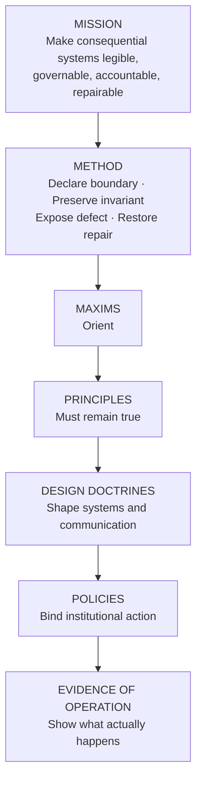

---

## 6. Covenant map

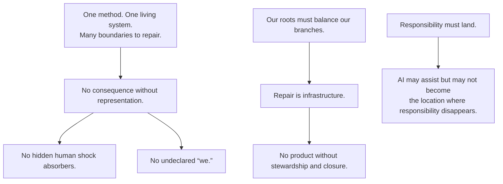

Edges show operational implication, not category equivalence.

---

## 7. Institutional closure map

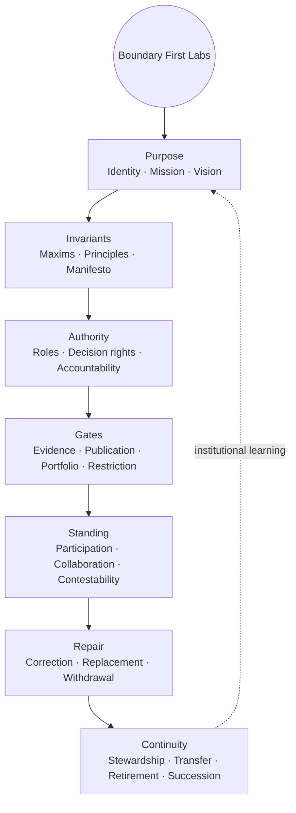

---

## 8. Collaboration lifecycle

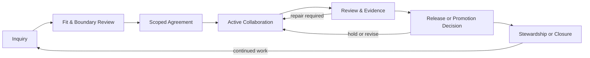

---

## 9. Collaboration modes

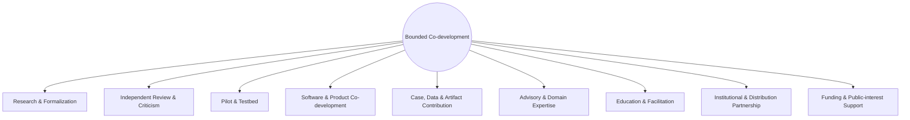

---

## 10. Role and authority firewall

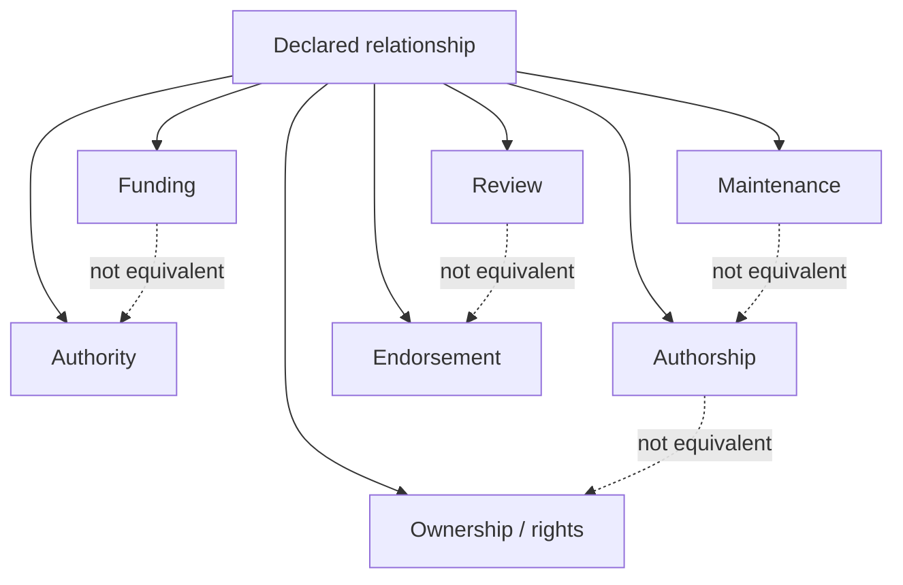

---

## 11. Participation to collaboration routing

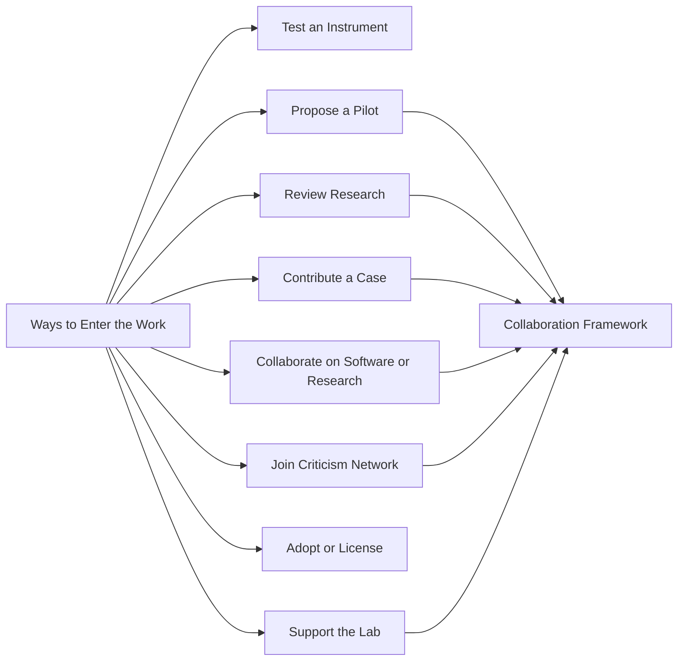

Participation is an entrance. Collaboration is the declared operating relationship.

---

## 12. Collaboration evidence loop

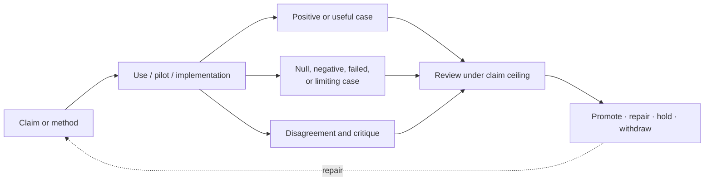

---

## 13. Context Halo with new filters

```text
┌──────────────────────────────────────────────────────────────────────────┐
│ REPRESENTATIONAL MECHANICS               [Node] [Halo] [Lineage] [Map] │
│                                                                          │
│ [Domains] [Work] [Evidence] [Lineage] [Governance] [Collaboration]      │
├──────────────────────────────────────────────────────────────────────────┤
│     MATHEMATICS                          PHYSICS                          │
│       ○       ○                            ○       ○                      │
│         ╲   ╱                                ╲   ╱                        │
│          ╲ ╱         faint relation field     ╲ ╱                         │
│                                                                          │
│             ╭──────────────────────────────────╮                         │
│             │             FACETS               │                         │
│             │    REPRESENTATIONAL MECHANICS    │                         │
│             ╰──────────────────────────────────╯                         │
│                ╱       ╲          ╱       ╲                              │
│               ▭         ⬡        ◇         ○                             │
│           PROJECT    PRODUCT   EVIDENCE  COLLABORATOR ROLE               │
│                                                                          │
│ ┌──────────────────────────────────────────────────────────────────────┐ │
│ │ RELATION SUMMARY · type · authority · evidence · status · closure   │ │
│ └──────────────────────────────────────────────────────────────────────┘ │
└──────────────────────────────────────────────────────────────────────────┘
```

---

## 14. Institutional page — desktop

```text
┌──────────────────────────────────────────────────────────────────────────┐
│ BOUNDARY FIRST LABS                           [Standard] [Closure Map]    │
│ Applied public-interest research institute                               │
│ FORMATION-STAGE · FOUNDER-LED · AI-ENABLED MICRO-LAB                    │
├──────────────────────────────────────────────────────────────────────────┤
│                                                                          │
│      PURPOSE                                                             │
│        ╲                                                                 │
│  CONTINUITY — INVARIANTS                                                 │
│       ╲          ╱                                                       │
│        BOUNDARY FIRST LABS            ┌───────────────────────────────┐  │
│       ╱          ╲                    │ SELECTED RECORD               │  │
│   REPAIR       AUTHORITY              │ PRINCIPLE · CLASSIFIED        │  │
│       ╲          ╱                    │ No consequence without        │  │
│     STANDING — GATES                  │ representation.               │  │
│                                      │ Binding: not yet adopted      │  │
│                                      │ Operation: evidence pending   │  │
│                                      │ [Source] [Related policies]   │  │
│                                      └───────────────────────────────┘  │
│                                                                          │
│ [Identity] [Mission] [Covenant] [Governance] [Participation]             │
│ [Collaboration] [Portfolio] [Continuity]                                 │
└──────────────────────────────────────────────────────────────────────────┘
```

---

## 15. Collaboration landing — desktop

```text
┌──────────────────────────────────────────────────────────────────────────┐
│ COLLABORATE THROUGH DECLARED BOUNDARIES                                  │
│ Boundaries are the conditions that make collaboration coherent.          │
├──────────────────────────────────────────────────────────────────────────┤
│ [Research] [Criticism] [Pilot] [Build] [Contribute] [Advise] [Teach]    │
│ [Partner] [Support]                                                       │
├──────────────────────────────────────────────────────────────────────────┤
│ LIFECYCLE                                                                │
│ Inquiry → Fit review → Scoped → Active → Review → Release → Closure      │
├──────────────────────────────────────────────────────────────────────────┤
│ PUBLIC PROMISE                                                           │
│ Understand what you are entering, what you may influence, what you       │
│ remain responsible for, how your work is credited and used, how          │
│ disagreement is preserved, and how the relationship may end.             │
│                                                                          │
│ [Propose collaboration] [Review work] [Bring a pilot] [Support the lab]  │
└──────────────────────────────────────────────────────────────────────────┘
```

---

## 16. Collaboration record

```text
┌──────────────────────────────────────────────────────────────────────────┐
│ COLLABORATION · ACTIVE · PILOT & TESTBED                                 │
│ Boundary-First Software Review Pilot                                     │
├──────────────────────────────────────────────────────────────────────────┤
│ Purpose          Test a bounded review instrument in live practice       │
│ Scope            Declared repository and review period                   │
│ Roles            Program Steward · Pilot Partner · Independent Reviewer  │
│ Authority        Review and recommend; no deployment authority           │
│ Outputs          Findings report · negative cases · revised method       │
│ Evidence gate    Predeclared success and failure criteria                │
│ Attribution      Declared contributors and review responsibility         │
│ Publication      Review required                                         │
│ Stewardship      Named owner                                              │
│ Closure          Data disposition · report · continuation decision       │
├──────────────────────────────────────────────────────────────────────────┤
│ [Overview] [Roles] [Rights] [Evidence] [Disagreement] [Closure]          │
└──────────────────────────────────────────────────────────────────────────┘
```

---

## 17. Product stewardship gate

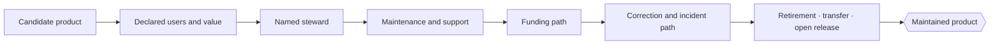

No maintained product state appears before this gate closes.

---

## 18. Governance lens

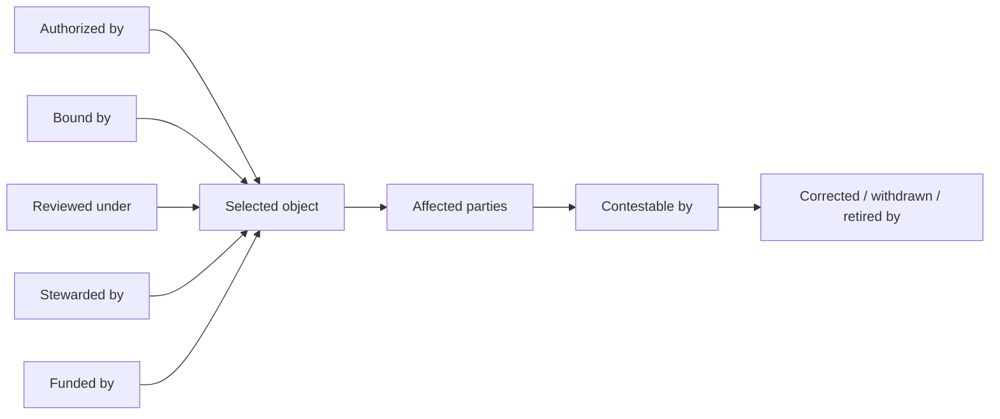

---

## 19. Conventional and Boundary First views

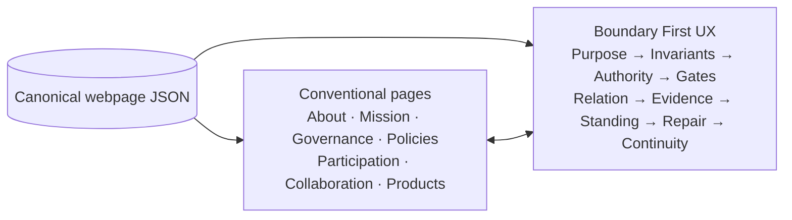

---

## 20. Status firewall

```text
Classification adjudicated
        ≠ formally adopted
        ≠ operationalized
        ≠ supported by evidence
        ≠ audited
```

```text
Collaboration inquiry
        ≠ partnership
        ≠ endorsement
        ≠ authorship
        ≠ ownership
        ≠ institutional authority
```

---

## 21. Mobile institutional view

```text
┌──────────────────────────────┐
│ Boundary First Labs         │
│ Formation-stage micro-lab   │
│ [Standard] [Map]            │
├──────────────────────────────┤
│ Purpose                     │
│ Invariants                  │
│ Authority                   │
│ Gates                       │
│ Standing                    │
│ Repair                      │
│ Continuity                  │
├──────────────────────────────┤
│ Selected record             │
│ TYPE · STATUS               │
│ Statement                   │
│ Binding / operation         │
│ [Source] [Related]          │
└──────────────────────────────┘
```

---

## 22. Mobile collaboration view

```text
┌──────────────────────────────┐
│ Collaboration               │
│ [Modes] [Lifecycle] [Roles] │
├──────────────────────────────┤
│ ▸ Research & Formalization  │
│ ▸ Review & Criticism        │
│ ▸ Pilot & Testbed           │
│ ▸ Software Co-development   │
│ ▸ Advisory                  │
│ ▸ Partnership               │
│ ▸ Funding & Support         │
├──────────────────────────────┤
│ Selected mode               │
│ Purpose                     │
│ Outputs                     │
│ Evidence                    │
│ Closure                     │
│ [Propose] [Read framework]  │
└──────────────────────────────┘
```

---

## 23. Reserved-content boundary

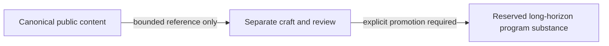

The current UX does not elaborate Self-Improving Representations or Agentic Scientific Method beyond the bounded canonical long-horizon statement.
