# Boundary First Labs Introductory Experience
## Mermaid Diagrams, Work-Layer Views, Context Halos, Historical Lineage, and Wireframes v0.4

**Status:** implementation-guidance draft  
**Supersedes:** `bfl_introductory_experience_mermaid_wireframes_v0_1.md` for presentation configuration; it does not supersede the canonical node data.  
**Purpose:** extend the guided experience with differentiated work entities, a mesoscopic Context Halo, and a works-first Historical Lineage lens that supplies foundations and context without endorsement, equivalence, or greatness-by-association claims.

## 1. Governing architecture

One union graph is exposed through multiple projections. The conceptual graph remains canonical; the work and evidence entities are joined through typed relations.

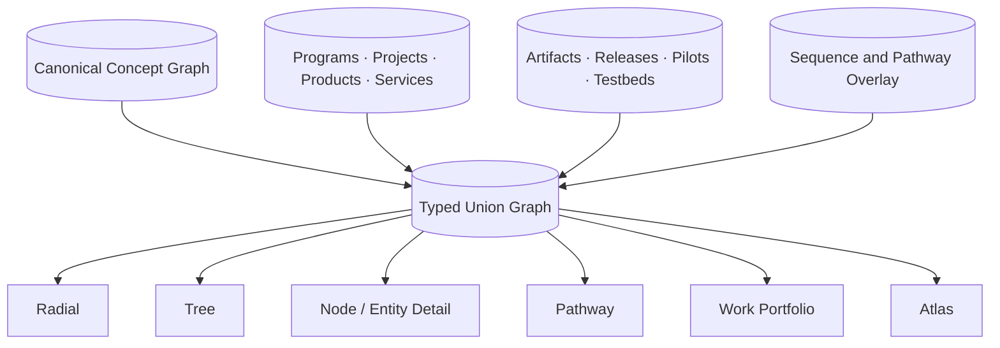

## 2. Type architecture

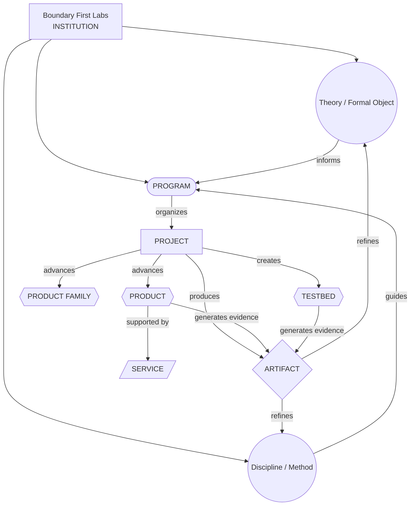

### Semantic distinction

- **Program:** a sustained line of inquiry, construction, or public work.
- **Project:** a bounded effort with an objective, scope, milestones, and closure condition.
- **Product:** a maintained thing made available to users with stewardship and retirement obligations.
- **Artifact:** a publication, release, dataset, report, diagram, or other durable witness.
- **Service:** a repeatable professional offering.
- **Testbed:** a bounded environment built to gather evidence.

## 3. Revised first-passage sequence

```mermaid
flowchart LR
    S0[0 Problem]
    S1[1 Boundary First]
    S2[2 Roots]
    S3[3 Synthesis]
    S4[4 Lived Convergence]
    S5[5 On-Ramps]
    S6[6 Distinction Space]
    S7[7 Boundary Theory]
    S8[8 Representational Mechanics]
    S9[9 Choose a Path]
    S10[10 The Work Takes Form\nPrograms · Projects · Products]
    S11[11 Work Earns Promotion\nEvidence · criticism · repair]
    S12[12 Atlas Reveal]

    S0 --> S1 --> S2 --> S3 --> S4 --> S5 --> S6 --> S7 --> S8 --> S9 --> S10 --> S11 --> S12
    S10 -->|See what we are building| PROJECTS[Projects]
    S10 -->|See what you can use| PRODUCTS[Products]
    PROJECTS --> S11
    PRODUCTS --> S11
```

### Scene 10 narrative contract

> Projects move the work forward. Products keep selected results available in the world. Artifacts witness what happened. Services repeat a bounded practice. Testbeds expose the work to reality.

The scene must show that a project can produce an artifact without producing a product, and that a product can continue through many projects.

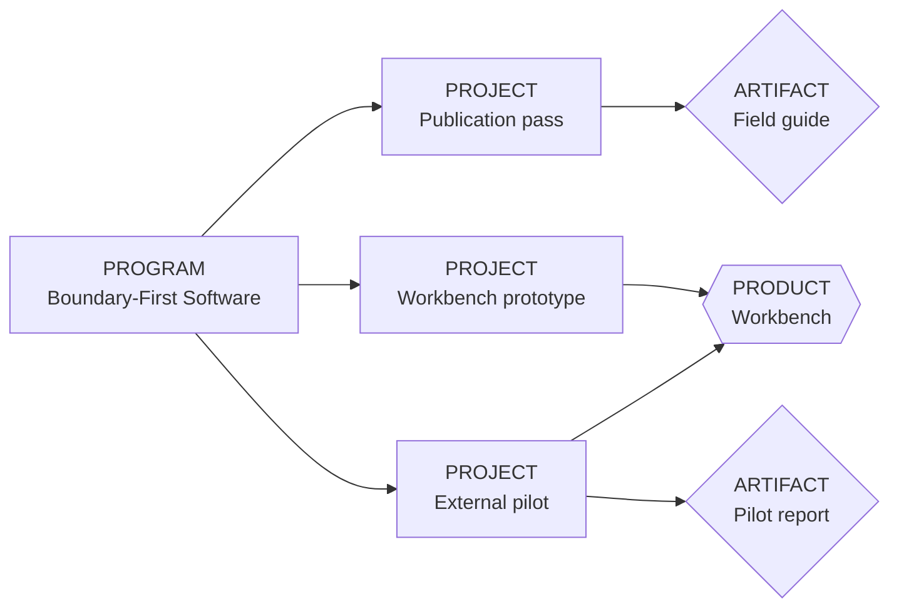

## 4. Build and Use pathway

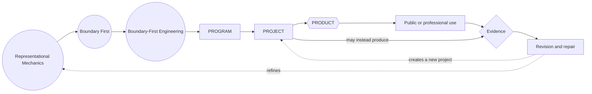

## 5. Corpus Forge identity split

The name `Corpus Forge` currently spans several roles. The UI must type each occurrence.

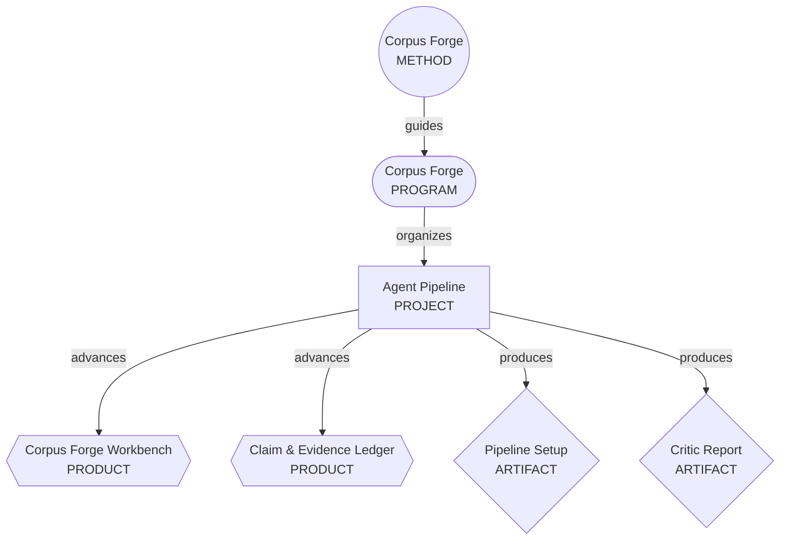

## 6. Boundary-First Chess identity split

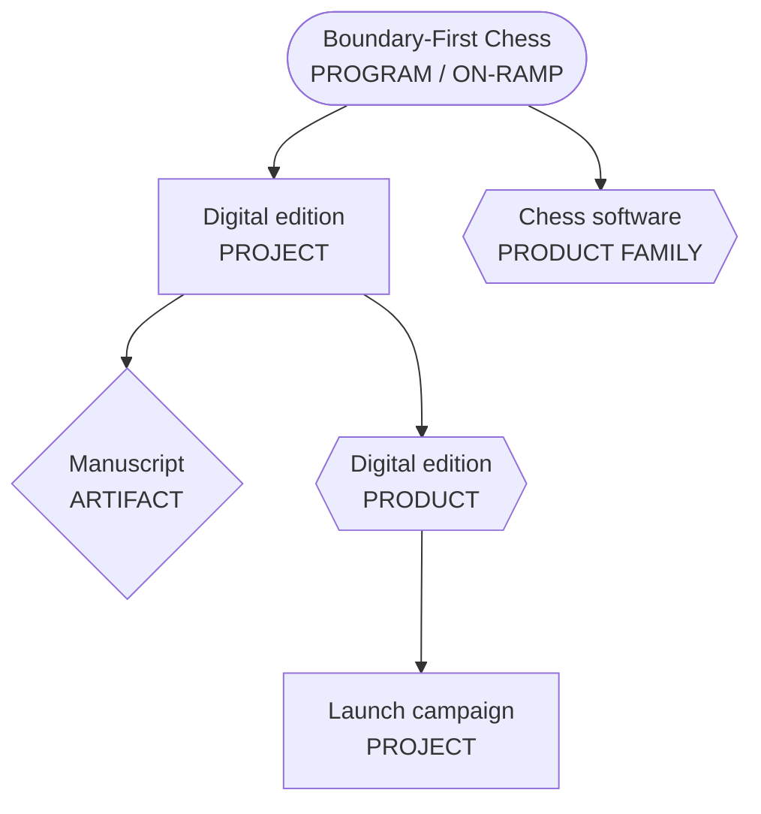

## 7. Portfolio atlas modes

```text
┌───────────────────────────────────────────────────────────────────┐
│ WORK & PORTFOLIO ATLAS                                            │
│ [ Concepts ] [ Work ] [ Evidence ] [ All ]                        │
│                                                                   │
│ Search __________________  Type ▾  State ▾  Maturity ▾  Domain ▾  │
├───────────────────────────────────────────────────────────────────┤
│                                                                   │
│   ○ Representational Mechanics                                    │
│         │                                                         │
│      [PROGRAM] Boundary-First Engineering                         │
│       ├── [PROJECT] Workbench prototype                           │
│       ├── [PROJECT] External pilot                                │
│       └── ⬡ PRODUCT Boundary-First Engineering Workbench          │
│                   └── ◇ ARTIFACT Pilot report                     │
│                                                                   │
└───────────────────────────────────────────────────────────────────┘
```

### Semantic zoom

- Far: concepts and programs, plus counts such as `4 projects · 2 products`.
- Mid: active projects and maintained/developing products.
- Near: artifacts, milestones, releases, evidence, and relation labels.

## 8. Projects collection

```text
┌──────────────────────────────────────────────────────────────────┐
│ PROJECTS                                                         │
│ Bounded efforts advancing research, products, and public work.   │
│                                                                  │
│ [Active] [Planned] [Review] [Complete] [All]                     │
│ Program ▾  Phase ▾  Participation ▾  Updated ▾                   │
├──────────────────────────────────────────────────────────────────┤
│ PROJECT · ACTIVE · VALIDATION                                    │
│ Corpus Forge Agent Pipeline                                      │
│ Build and test the supervised Operator–Critic workflow.          │
│ Advances: Corpus Forge Workbench · Claim & Evidence Ledger       │
│ Produces: Pipeline specification · critic reports                 │
│ Next gate: first complete vertical slice                          │
│ [Open project] [View outputs] [Follow]                            │
├──────────────────────────────────────────────────────────────────┤
│ PROJECT · ACTIVE · DEFINITION                                    │
│ Boundary First Labs Introductory Experience                      │
│ Build the guided passage, pathway system, and atlas reveal.      │
│ Produces: wireframes · implementation config · work-layer packet │
└──────────────────────────────────────────────────────────────────┘
```

## 9. Products collection

```text
┌──────────────────────────────────────────────────────────────────┐
│ PRODUCTS                                                         │
│ Tools, publications, instruments, platforms, and utilities.      │
│                                                                  │
│ [Available] [Pilot] [Prototype] [Concept] [Retired]              │
│ Class ▾  Standing ▾  Lifecycle ▾  Availability ▾                 │
├──────────────────────────────────────────────────────────────────┤
│ PRODUCT · CONFIRMED · GOVERNED CONCEPT                           │
│ Corpus Forge Workbench                                           │
│ Governed transformation of source material into durable,         │
│ traceable research systems.                                      │
│ For: researchers · authors · labs · institutions                 │
│ Availability: active development                                 │
│ [View product] [Follow progress] [Related projects]               │
├──────────────────────────────────────────────────────────────────┤
│ PRODUCT FAMILY · CONFIRMED · GOVERNED CONCEPT                    │
│ Boundary-First Chess Software                                    │
│ Interactive teaching and analysis surfaces derived from the      │
│ Boundary-First Chess program.                                    │
│ Availability: concrete products not yet separated                │
└──────────────────────────────────────────────────────────────────┘
```

## 10. Project detail shell

```text
┌──────────────────────────────────────────────────────────────────┐
│ PROJECT                                                          │
│ Corpus Forge Agent Pipeline                     ACTIVE · VALIDATION│
│ Build and validate a supervised corpus-refinement workflow.      │
│                                                                  │
│ Program: Corpus Forge       Steward: Unassigned                  │
│ Current gate: First complete vertical slice                      │
│                                                                  │
│ [Overview] [Scope] [Workstreams] [Milestones]                    │
│ [Outputs] [Evidence] [Dependencies] [History]                    │
├──────────────────────────────────────────────────────────────────┤
│ Objective                                                        │
│ Scope / exclusions                                               │
│ Workstreams                                                      │
│ Products advanced                                                │
│ Artifacts produced                                               │
└──────────────────────────────────────────────────────────────────┘
```

## 11. Product detail shell

```text
┌──────────────────────────────────────────────────────────────────┐
│ PRODUCT                                                          │
│ Corpus Forge Workbench                    CONFIRMED · CONCEPT     │
│ Governed corpus transformation for researchers and institutions. │
│                                                                  │
│ Availability: Active development                                 │
│ Stewardship: Owner / maintenance / funding / incident / sunset   │
│                                                                  │
│ [Overview] [Users] [Capabilities] [Availability]                 │
│ [Evidence] [Projects] [Stewardship] [Releases] [Roadmap]         │
├──────────────────────────────────────────────────────────────────┤
│ Value proposition                                                │
│ Intended users                                                   │
│ Current capabilities and limitations                             │
│ Related projects and evidence                                    │
└──────────────────────────────────────────────────────────────────┘
```

## 12. Data-preservation rule

The current `products-testbeds.softwarePortfolio` array is not deleted during migration. Every entry is copied intact into the migration seed under `sourceData`. Type, lifecycle, and operating-state recommendations are additive and remain reviewable until promoted into canonical first-class entities.

## 13. Implementation order

1. Add the entity-type registry, shape grammar, and text kickers.
2. Add the `Work` projection and atlas layer toggles.
3. Add first-class Project and Product card/detail components.
4. Insert `The Work Takes Form` into the first-passage sequence.
5. Add the Build and Use pathway.
6. Load the project seed and portfolio migration seed as non-canonical overlays.
7. Human-review ambiguous source entries before promotion.
8. Split overloaded names such as Corpus Forge, Boundary-First Chess, Weather@Home, and Boundary-First Soccer into typed entities.


# Context Halo refinement

## 18. Four navigational scales

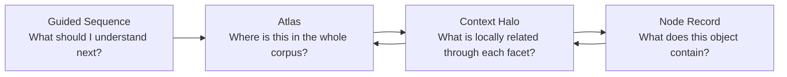

The Context Halo is the mesoscopic layer between the full atlas and the isolated node record.

## 19. Context Halo anatomy

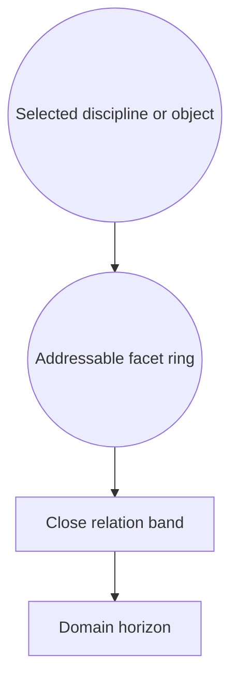

```text
┌────────────────────────────────────────────────────────────────────┐
│ MATHEMATICS                         PHYSICS                         │
│ Geometry · Topology                 Fields · Quantum · Thermo       │
│      ○        ○                         ○        ○                   │
│       ╲      ╱                           ╲      ╱                    │
│        ╲    ╱      faint relation field   ╲    ╱                     │
│                                                                    │
│             ╭──────────────────────────────────╮                   │
│             │          FACET RING              │                   │
│             │                                  │                   │
│             │    REPRESENTATIONAL MECHANICS    │                   │
│             │                                  │                   │
│             ╰──────────────────────────────────╯                   │
│                 ╱       ╲              ╱       ╲                   │
│                ○         ○            ○         ○                  │
│        COMPUTATION   ENGINEERING   GOVERNANCE   LAW                │
│                                                                    │
│ [Close only] [Domains] [Projects] [Products] [Evidence]            │
└────────────────────────────────────────────────────────────────────┘
```

## 20. Representational Mechanics reference order

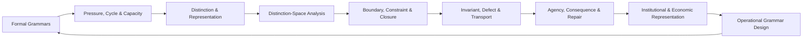

This circular ordering clusters many formal and scientific relations across the upper and right arcs while preserving the wrap adjacency between Operational Grammar Design and Formal Grammars.

## 21. Domain horizon families

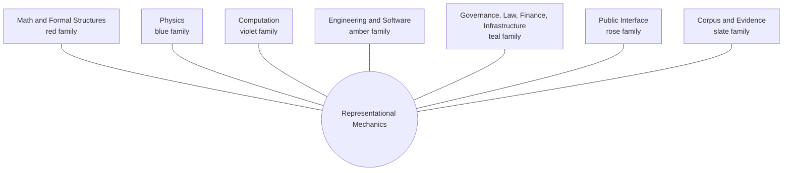

Color remains supplemental. Shape identifies entity type; labels identify domain family; edge weight and style identify relationship strength and type.

## 22. Interaction states

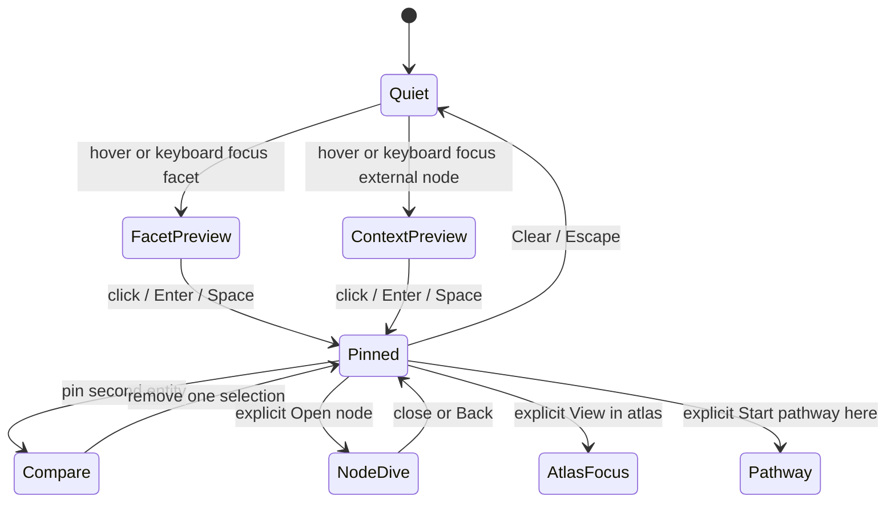

### Facet focus

Hovering or focusing a facet:

- raises related context nodes to full legibility;
- reveals their edge bundles;
- suppresses unrelated horizon nodes;
- opens a compact relationship summary.

### Context-node focus

Hovering or focusing an external entity:

- highlights every connected facet;
- labels each relation type and strength;
- explains why the entity belongs in the local field.

The first click pins context; navigation requires an explicit action.

## 23. Projects and products at the horizon

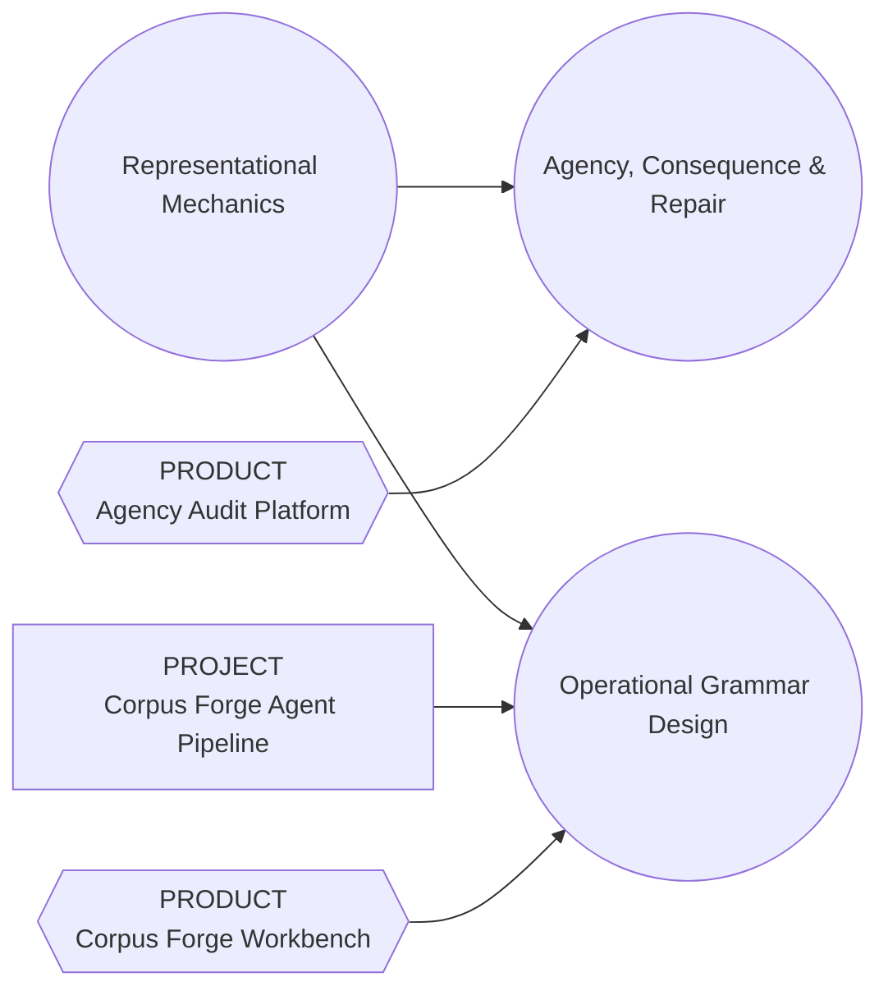

Entity shape remains the project/product grammar from the v0.2 work layer. Domain-family hue indicates where the work primarily lives.

## 24. Context relationship card

```text
┌────────────────────────────────────────────────────┐
│ TOPOLOGY, HOMOLOGY & OBSTRUCTION                   │
│ MATHEMATICS · RESEARCH SHELF                       │
│                                                    │
│ Boundary, Constraint & Closure       strong        │
│ Formalizes boundary and gluing structure.          │
│                                                    │
│ Invariant, Defect & Transport        load-bearing  │
│ Supplies cycles, obstruction classes, persistence. │
│                                                    │
│ [Pin] [Open node] [View in atlas] [Start here]      │
└────────────────────────────────────────────────────┘
```

## 25. Mobile Context Halo

```text
┌──────────────────────────────┐
│ Representational Mechanics  │
│ [Node] [Halo] [Atlas]       │
├──────────────────────────────┤
│     scrollable facet wheel  │
│                              │
│  Related domains            │
│  MATHEMATICS  8 relations   │
│  PHYSICS      7 relations   │
│  COMPUTATION  6 relations   │
│                              │
│  Selected relation card     │
│  [Pin] [Open] [Atlas]       │
└──────────────────────────────┘
```

On narrow screens, the horizon becomes grouped, expandable family lists rather than clipped free-floating nodes. The same relation data and pin state are preserved.


# Historical Lineage & Foundations Layer

## 26. Five navigation scales


The Lineage Lens is external intellectual context. The node History tab remains the internal development and replacement history of the Boundary First corpus.

## 27. Works-first lineage architecture

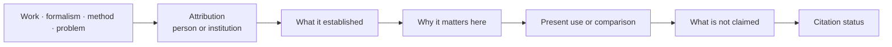

A historical name never appears without an inherited object, formalism, method, problem, or critical contribution.

## 28. Introductory-scene historical strip

```text
┌─────────────────────────────────────────────────────────────────┐
│ DISTINCTION SPACE                                               │
│ [ The Idea ] [ Foundations ] [ Present Development ]            │
├─────────────────────────────────────────────────────────────────┤
│ FOUNDATIONAL WORLDS                                             │
│                                                                 │
│ Riemannian geometry  →  topology and gluing  →  operator theory │
│ Bernhard Riemann         Poincaré et al.       Dirac / von N.   │
│                                                                 │
│ Spectral geometry  →  noncommutative geometry                   │
│ Mark Kac              Alain Connes                              │
│                                                                 │
│ Foundations and comparison obligations—not claims of            │
│ equivalence, endorsement, succession, or validation.            │
│                                            [Explore lineage]     │
└─────────────────────────────────────────────────────────────────┘
```

The default tab remains `The Idea`. The historical strip is optional context, not an interruption of the main conceptual sequence.

## 29. Computation lineage pathway

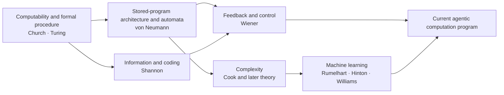

Caption contract: current work is developed inside these traditions; it is not described as completing or superseding them.

## 30. Mathematics lineage pathway

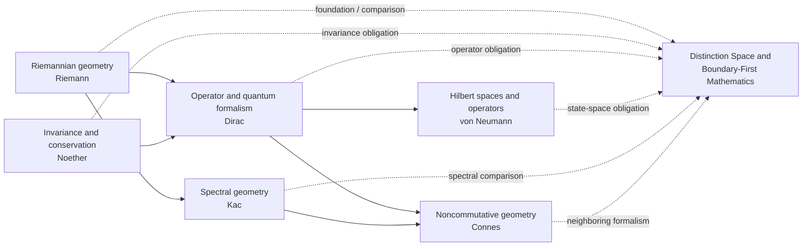

These edges identify formal foundations and audit obligations. They do not claim equivalent contribution or direct succession.

## 31. Physics lineage pathway

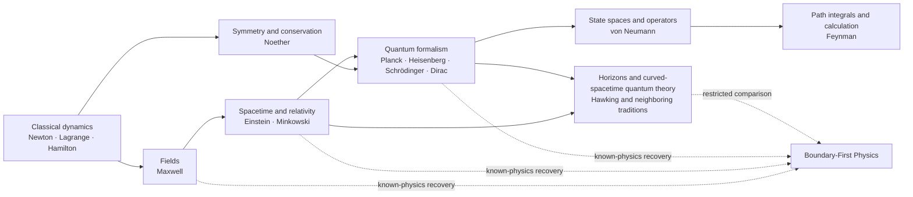

No physical hypothesis gains authority through proximity to these figures. Dimensional validity, known-physics recovery, prediction, empirical comparison, and external review remain mandatory.

## 32. Lineage Lens wireframe

```text
┌──────────────────────────────────────────────────────────────────┐
│ REPRESENTATIONAL MECHANICS        [Node] [Halo] [Lineage] [Map] │
├──────────────────────────────────────────────────────────────────┤
│ Filters: Formalism · Method · Precedent · Critique · Neighbor    │
│                                                                  │
│ Riemannian geometry ───────────────┐                              │
│ Riemann · 1854                    │                              │
│                                   ▼                              │
│                   ┌────────────────────────────┐                 │
│ Cybernetics ─────▶│ REPRESENTATIONAL MECHANICS │◀── Semiotics   │
│ Wiener             └────────────────────────────┘     Peirce      │
│                                   ▲                              │
│ Boundary objects ────────────────┘                               │
│ Star & Griesemer                                                │
│                                                                  │
│ ┌──────────────────────────────────────────────────────────────┐ │
│ │ FOUNDATIONAL FORMALISM                                      │ │
│ │ Riemannian geometry · Bernhard Riemann · 1854               │ │
│ │ What it established …                                       │ │
│ │ Why it matters here …                                       │ │
│ │ Present use …                                               │ │
│ │ Not claimed …                                               │ │
│ │ Citation: edition verification required                     │ │
│ └──────────────────────────────────────────────────────────────┘ │
└──────────────────────────────────────────────────────────────────┘
```

## 33. Context Halo lineage mode

```text
[ Domains ] [ Work ] [ Evidence ] [ Lineage ]
```

With `Lineage` active:

- works and formalisms occupy the outer horizon;
- edges are dotted or fine-dashed;
- relation class is always available as text;
- hover or focus highlights the facets informed, challenged, or compared;
- historical nodes are never placed above the selected node as implied authorities;
- the global non-claim remains visible in the relation summary.

## 34. Anti-aggrandizement firewall

Required public statement:

> These references identify foundational works, inherited formalisms, neighboring research traditions, and critical comparisons. They do not imply endorsement, equivalence, direct succession, or validation of Boundary First Labs.

Preferred verbs: `builds within`, `draws upon`, `is guided by`, `uses the formalism of`, `inherits a problem from`, `develops alongside`, `compares with`, `reinterprets through`.

Prohibited without independent evidence: `completes`, `solves`, `supersedes`, `unifies`, `fulfills`, `continues the legacy of`, `stands alongside`, `is the next`.

## 35. Mobile lineage behavior

```text
FOUNDATIONS & LINEAGE
This layer identifies foundations and obligations, not endorsement.

▸ Geometry and structured space (5)
▸ Operators and spectra (4)
▸ Computation and information (6)
▸ Critical counterpoints (3)
▸ Present development
```

The global non-claim remains at the top. Cards expand vertically; no content depends on hover.


---

# v0.5 — Boundary First UX and Institutional Operating Architecture

**Status:** provisional UI and information-architecture scaffold. Institutional content remains governed by the source register and distinction audit.

## Boundary First UX

> Boundary First UX progressively reveals what an object is, how it relates, what governs it, what it affects, and how it can be challenged or repaired—without requiring the user to comprehend the entire system at once.

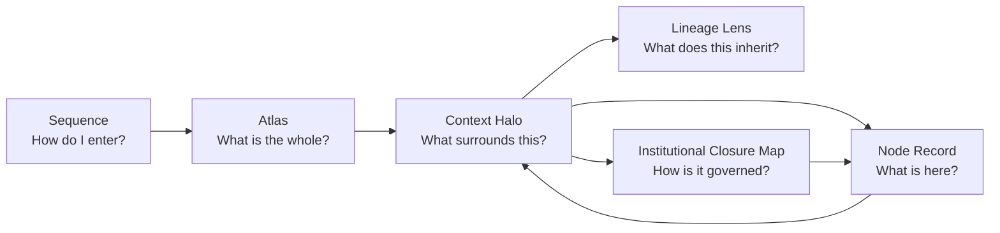

## Institutional closure map

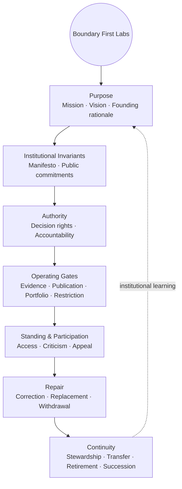

## Introductory-sequence integration

```mermaid
flowchart LR
    PROBLEM[The Problem<br/>Mission promise]
    METHOD[Boundary First<br/>Mission becomes method]
    ROOTS[Roots & Lineage]
    THEORY[Theory & Discipline]
    WORK[Projects and Products]
    EVIDENCE[Evidence and Promotion]
    SELF[The Institution Binds Itself]
    MAP[Atlas Reveal]

    PROBLEM --> METHOD --> ROOTS --> THEORY --> WORK --> EVIDENCE --> SELF --> MAP
```

## Governance lens

```mermaid
flowchart LR
    O[Selected claim, project, product,<br/>publication, policy, or service]
    AUTH[Authorized by]
    BOUND[Bound by]
    REVIEW[Reviewed under]
    STEWARD[Stewarded by]
    AFFECTED[Affected parties]
    CONTEST[Contestable by]
    REPAIR[Corrected, replaced,<br/>withdrawn, transferred, or retired by]

    AUTH --> O
    BOUND --> O
    REVIEW --> O
    STEWARD --> O
    O --> AFFECTED
    AFFECTED --> CONTEST
    CONTEST --> REPAIR
```

## Desktop wireframe — How the Lab Operates

```text
┌──────────────────────────────────────────────────────────────────────────────┐
│ HOW THE LAB OPERATES                       [Standard view] [Governance lens] │
├──────────────────────────────────────────────────────────────────────────────┤
│                                                                              │
│             PURPOSE                                                          │
│        ╭────────────────╮                                                    │
│   CONTINUITY          INVARIANTS                                              │
│      ╲                  ╱                                                     │
│       ╲  BOUNDARY FIRST ╱             ┌───────────────────────────────────┐  │
│        ╲     LABS      ╱              │ INSTITUTIONAL STATEMENT           │  │
│   REPAIR              AUTHORITY        │ TYPE · STATUS · SCOPE             │  │
│        ╲              ╱                │                                   │  │
│         STANDING — GATES               │ Exact source-backed statement     │  │
│                                        │ Binding: proposed / unverified    │  │
│                                        │ Operation: not yet recorded       │  │
│                                        │ [View source] [Open standard page]│  │
│                                        └───────────────────────────────────┘  │
│                                                                              │
│ [Purpose] [Invariants] [Authority] [Gates] [Standing] [Repair] [Continuity] │
└──────────────────────────────────────────────────────────────────────────────┘
```

## Status firewall

```text
Descriptive ≠ Aspirational ≠ Declared principle ≠ Declared commitment
             ≠ Proposed policy ≠ Adopted ≠ Operationalized ≠ Audited
```

The interface must never advance a statement across those boundaries without an explicit source record.

## Conventional and Boundary First projections

```mermaid
flowchart LR
    DATA[(Versioned institutional records)]
    STANDARD[Conventional pages<br/>About · Mission · Vision · Governance · Policies]
    BFUX[Boundary First UX<br/>Purpose → Invariants → Authority → Gates → Standing → Repair → Continuity]

    DATA --> STANDARD
    DATA --> BFUX
    STANDARD <--> BFUX
```
