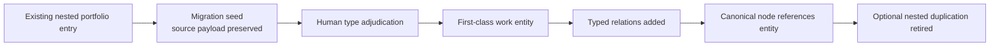

# Boundary First Labs Project/Product Presentation Migration
## Non-Destructive Application Plan v0.1

## Goal

Make projects and products unmistakable throughout the introductory sequence, pathways, search, node views, and atlas without flattening them into conceptual domains or deleting the detailed portfolio data already attached to `products-testbeds`.

## Applied changes

- Adds a typed **Work** projection beside Sequence, Radial, Tree, Node, Pathway, and Atlas.
- Adds first-class entity types for program, project, product, product family, artifact, service, and testbed.
- Adds a new first-passage scene: **The Work Takes Form**.
- Adds a **Build and Use** pathway.
- Adds Project and Product collection/detail contracts.
- Adds shape, kicker, status, lifecycle, and stewardship requirements.
- Extracts all 24 existing software-portfolio payloads into a non-destructive migration seed.
- Seeds six project records from existing artifacts and current active work.

## Preservation guarantee

The migration seed stores every original portfolio record verbatim under `sourceData`. Recommended types and lifecycle states are additive. No item should be removed from the canonical node until a promoted first-class entity exists and the node retains a reference to it.

## Promotion sequence



## Ambiguous items requiring adjudication

| Source item | Why it is overloaded | Recommended split |
|---|---|---|
| Corpus Forge | Method, operating program, workflow, and product language coexist | Method + program + development projects + Workbench product |
| Weather@Home and Boundary-First Weather | Research lane and possible product surfaces coexist | Research program + explicit testbeds/products as scoped |
| Boundary-First Chess Software | Multiple possible software offerings are grouped together | Product family until concrete products are defined |
| Boundary-First Soccer | Early theory/on-ramp work is currently in a software portfolio | Research/on-ramp project; product only after a maintained offering exists |
| Single-Purpose Phone Modes | Framework and product family coexist | Product family plus concrete mode products later |
| Constructive Media Protocol | Protocol, infrastructure, and hosted product possibilities coexist | Protocol entity plus products/services when separately scoped |

## Definition of done for this refinement

- A screenshot communicates entity type without relying on color.
- Project and product names cannot be confused with theory or method nodes.
- A project card shows objective, state, phase, outputs, and next gate.
- A product card shows users, value, standing, lifecycle, availability, evidence, and stewardship.
- The atlas can hide or reveal work and evidence layers independently.
- The introductory sequence teaches the project/product distinction before the evidence pipeline.
- All prior portfolio fields remain recoverable after migration.


## Context Halo additive migration

The Context Halo does not promote every facet into a top-level atlas node. It adds stable local facet IDs and a separate relationship layer:

```text
canonical node and facet labels
        ↓
assign stable local facet IDs
        ↓
author facet-targeted relation records
        ↓
editorially approve facet order
        ↓
render local relation field
```

Original facet labels, node bodies, documents, programs, projects, and products remain in their existing sources. A local relation may be corrected or removed without deleting either endpoint.
