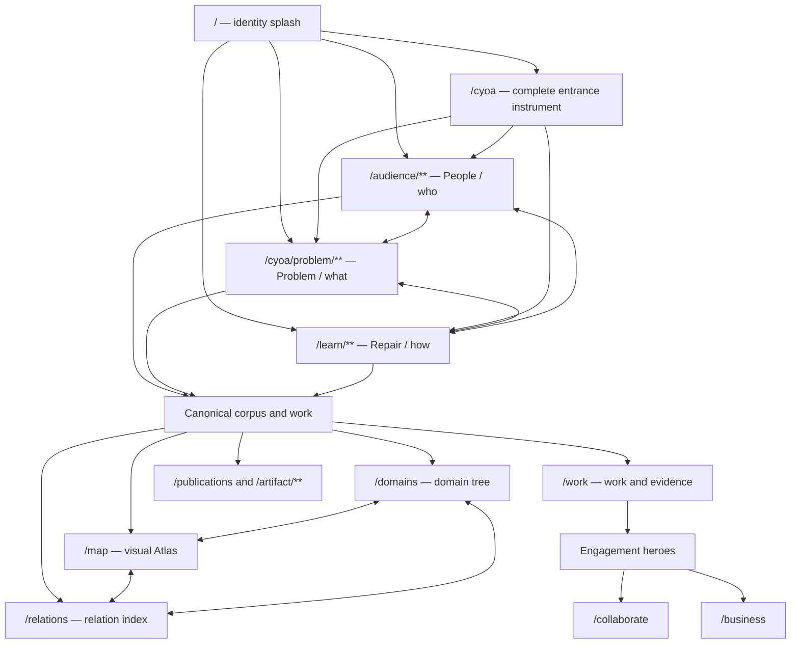

# Boundary First Labs Layered Routing Phase 1 Implementation Review v0.1

**Status:** Implemented locally; validation complete  
**Date:** 2026-08-07  
**Scope:** Public identity layer, interchangeable on-ramps, semantic route state, research projections, engagement folding, and responsive navigation  
**Primary implementation:** `Webpage/src`  
**Preceding specification:** [`README.md`](./README.md)  
**Companion audit:** [`site-map-localhost-3000.md`](../../output/site-map-localhost-3000.md)  
**Technical routing specification:** [`onramp-routing-integration.md`](../../output/onramp-routing-integration.md)

## 1. Executive conclusion

Phase 1 establishes that Boundary First can remain intentionally sprawling without presenting itself as a collection of unrelated mini-sites.

The site now treats **People**, **Problem**, and **Repair** as equal sibling lenses over one governed body of work. Each lens keeps its own local grammar, but all three share identity, route context, milestone language, cross-lens switching, and convergence on canonical research, publications, artifacts, Work, and the Atlas.

The simplification achieved in this phase is therefore structural rather than reductive:

> Coordinate the routes before cutting the corpus.

This phase does not select a final shared URL namespace, remove valid content, or declare one entrance to be the primary or “real” route. Those decisions remain evidence-dependent.

## 2. Phase boundary and refined decisions

The implementation refines the earlier unified on-ramp specification in five important ways.

### 2.1 Identity and entrance are separate layers

`/` is now the explicit identity layer: a full-viewport splash, institutional statement, and progressive reveal of the three entrances. The global **Start** navigation points to `/cyoa`, which remains the complete entrance instrument.

This gives the two routes different jobs:

- `/` establishes recognition and deliberately replays the identity experience when explicitly visited;
- `/cyoa` exposes all three entrances immediately for ordinary route selection.

The current concentric mark is a CSS-based identity placeholder. A final logo asset can replace it without changing any routing behavior.

### 2.2 Layering is a durable UX principle

The People route now presents its decisions in sequence:

```text
need -> position -> familiar doorway -> arrival
```

The earlier specification treated deeper People questions as optional refinement. The implemented interpretation preserves the user's stronger structural direction: multiple layers should become visible over time. After the first choice, visitors still receive route-neutral exits to Work, the Atlas, and the three-path instrument, so the sequence does not become a trap.

### 2.3 Interchangeable means sibling, not identical

The three local route grammars were not flattened into matching segment counts. “Interchangeable” now means:

- each route identifies its current lens;
- the other two lenses remain visible and reachable;
- every local state maps to a shared semantic milestone;
- switching lenses opens the sibling root rather than inventing a false step-to-step equivalence;
- all three routes converge on the same canonical corpus.

### 2.4 Horizontal navigation is the default pattern

The revised surfaces do not use persistent left-hand navigation. Guided Repair scenes, About's institutional index, and About's closure layers now use horizontal, scrollable controls that work as rails on narrow viewports and full rows on wider ones.

This is a phase-level design rule, not a page-specific styling preference:

> Navigation should adapt by wrapping, scrolling, collapsing, or changing density—not by assuming a permanently available left column.

Contextual side content remains allowed when it is content rather than navigation.

### 2.5 Collaborate and Enterprise are folded, not erased

Collaborate and Enterprise are presented as large paired engagement heroes on both Work and About. Their standalone URLs remain available as deeper framework or conversion destinations:

- `/collaborate`
- `/business`

They are no longer treated as conceptual peers of People, Problem, and Repair. They are bounded ways for the shared body of work to enter a relationship or operational setting. A later phase should retain the standalone pages only if ownership, response behavior, and conversion purpose remain active.

## 3. Implemented route architecture



### Current URL contracts

| Lens or layer | Canonical form | Meaningful local states | Shared milestone mapping |
|---|---|---|---|
| Identity | `/` | splash; progressive reveal held in session state | identity / orientation |
| Entrance instrument | `/cyoa` | all three lenses visible | orientation |
| People | `/audience/**` | intent; audience position; doorway; depth | orientation -> selection -> route -> arrival |
| Problem | `/cyoa/problem/**` | familiar world; consequential scene | orientation -> selection -> arrival |
| Repair | `/learn/**` | introduction plus fourteen semantic scene IDs | orientation -> route -> arrival |
| Research projections | `/domains`, `/map`, `/relations` | tree, spatial, and conventional-text views | shared corpus |
| Engagement | `/work#engage`, `/about#engage` | Collaborate and Enterprise heroes | convergence / next action |

### Canonicalization and compatibility

- Repair scenes now use stable paths such as `/learn/boundary-first`, `/learn/roots`, and `/learn/atlas-reveal`.
- Legacy `/learn?scene=N` links redirect to the equivalent semantic scene path.
- Legacy `/cyoa/{family}/**` paths redirect once to `/cyoa/problem/{family}/**`.
- Splash animation frames never modify the URL or browser history.
- Entrance provenance is session context, not canonical content identity.
- Repair scene paths are included in the XML sitemap.
- People and Problem routes remain `noindex` while their public indexing policy is unresolved; Repair scenes are individually canonical.

## 4. Shared behavioral contract

The following rules are now implemented and should be treated as regression boundaries.

1. **Every entrance remains available.** Deep People, Problem, and Repair screens show all three sibling lenses.
2. **Semantic state belongs in the URL.** Intent, audience position, doorway, Problem scene, and Repair scene can be reconstructed from navigation state.
3. **Presentation state does not belong in the URL.** Splash reveal timing and abbreviated returning-visitor behavior use session storage.
4. **Local routes retain their own grammar.** Shared milestones describe comparable meaning, not identical step numbers.
5. **Switching lenses starts a meaningful new path.** It goes to the sibling root and creates normal browser history.
6. **Canonical records remain route-neutral.** A domain or artifact is not duplicated for each entrance.
7. **Provenance is optional and bounded.** Work, domain, and artifact pages may say which entrance was used during the last thirty minutes, but their content remains complete without that context.
8. **Research views change projection, not object.** Domains, Atlas, and Relations explicitly identify themselves as views of the same research architecture.
9. **No left-side navigation is required.** Primary sequence and section navigation must survive narrow, wide, touch, keyboard, and zoomed viewports.
10. **Engagement is downstream of the corpus.** Collaborate and Enterprise are relationship surfaces, not additional doctrine entrances.

## 5. Implementation map

| Responsibility | Primary source |
|---|---|
| Canonical three-route content and invariant | `src/content/entry-triad.binding.json` |
| Shared IDs and milestones | `src/lib/entrance/types.ts` |
| Shared route registry | `src/lib/entrance/registry.ts` |
| Path and milestone resolution | `src/lib/entrance/resolve.ts` |
| Session keys and provenance shape | `src/lib/entrance/session.ts` |
| Full-screen identity and progressive reveal | `src/components/entrance/SplashEntranceHome.tsx` |
| Horizontal entrance switcher | `src/components/entrance/EntranceSwitcher.tsx` |
| Route-neutral arrival context | `src/components/entrance/EntranceArrivalBar.tsx` |
| Semantic Repair scene navigation | `src/components/guided-sequence-v2.tsx`, `src/app/learn/[scene]/page.tsx` |
| Research view switching | `src/components/research-projection-switcher.tsx` |
| Collaborate and Enterprise folding | `src/components/engagement-heroes.tsx` |
| Global Start and active-route grouping | `src/lib/site-navigation.ts` |
| Canonical public scene discovery | `src/app/sitemap.ts` |

The registry is the shared routing authority for the new UI. Existing local resolvers remain responsible for validating People and Problem states, and the introductory experience configuration remains responsible for Repair scene content.

## 6. Verification record

The implementation passed the following checks on 2026-08-07:

- `npx vitest run`: **13 test files, 73 tests passed**;
- `npm run build`: production build completed, including **145 generated pages**;
- `npm run lint`: passed with two warnings confined to generated Playwright crawl scripts in `output/playwright`;
- browser console: **zero application errors** during the reviewed flows;
- responsive review: desktop at 1440 x 900 and mobile at 390 x 844;
- browser history: Repair Next and Back restored both the semantic URL and the correct scene;
- redirect review: legacy CYOA and Repair links reached their canonical paths;
- accessibility structure: semantic headings, labelled navigation regions, `aria-current`, keyboard controls, skip behavior, and reduced-motion handling were preserved.

Representative captures:

- [`desktop-splash.png`](../../output/playwright/desktop-splash.png)
- [`mobile-splash.png`](../../output/playwright/mobile-splash.png)
- [`mobile-entrance-cards.png`](../../output/playwright/mobile-entrance-cards.png)
- [`mobile-repair-routing.png`](../../output/playwright/mobile-repair-routing.png)
- [`work-engagement.png`](../../output/playwright/work-engagement.png)
- [`about-closure-horizontal.png`](../../output/playwright/about-closure-horizontal.png)
- [`about-standard-horizontal-index.png`](../../output/playwright/about-standard-horizontal-index.png)

## 7. Review findings and residual risks

### What this phase proves

- Route breadth is not itself the intelligibility problem; uncoordinated route identity was the larger problem.
- Progressive disclosure and deep-linkable state can coexist when only semantic decisions enter the URL.
- Horizontal controls can replace desktop left navigation without collapsing the number of available choices.
- Collaborate and Enterprise can be visible and conversion-capable without becoming additional top-level conceptual entrances.
- A splash page can strengthen routing when its role is explicitly limited to identity and handoff.

### What remains incomplete

1. **Final logo asset:** the splash shell is production-shaped, but the current mark is not a final supplied logo or animation.
2. **Observed visitor evidence:** no analytics or participant study yet shows which entrance, copy, or layer is clearest to newcomers.
3. **Adaptive switcher density:** the full three-card switcher appears on every entrance state. A later pass may reduce its visual density after orientation while preserving its semantics.
4. **Provenance depth:** session context records only the entrance ID and timestamp. It does not retain a deep route trail, resume target, or cross-lens recommendation.
5. **Public indexing policy:** People and Problem are still no-index teaching routes. Their release and canonical policy needs an explicit decision.
6. **Conversion status:** `/collaborate` and `/business` remain live destinations, but this phase did not verify a named owner, response expectation, analytics event, or conversion success condition.
7. **Content reduction:** Work, About, and the wider corpus remain dense. This phase intentionally avoided deleting content before the route grammar became legible.
8. **Cross-shell consistency:** Problem retains a specialized immersive header while most pages use the standard institutional shell. This is acceptable for now but should be tested for orientation cost.
9. **Accessibility depth:** automated structure and responsive checks passed, but screen-reader sequencing, 200% zoom, switch-control use, and long horizontal-rail keyboard behavior still need human testing.
10. **Institutional identity boundary:** `/about` and `/domain/identity` still represent different views of the institution and need clearer public cross-framing.

## 8. Recommended Phase 2 sequence

The next phase should pare down the experience only after collecting evidence about the new structure.

### A. Instrument the route system

Record privacy-respecting events for:

- splash continue and skip;
- initial lens selection;
- lens switching;
- completion or exit milestone;
- research projection switching;
- engagement hero selection;
- contact-action activation.

Measure route comprehension and useful arrival rather than raw page count.

### B. Run newcomer task tests

Ask participants to complete four tasks without prior explanation:

1. explain what Boundary First is;
2. choose a beginning and predict what it will provide;
3. change to another lens without using browser Back;
4. find one concrete research record, artifact, or way to engage.

Capture hesitation points, unexpected labels, repeated copy, and abandoned layers.

### C. Create a content disposition register

For each visitor-facing page or major section, record one disposition:

- **retain:** unique and necessary;
- **promote:** belongs on the newcomer spine;
- **fold:** retain content inside a stronger parent page or hero;
- **defer:** valid but not needed in the initial journey;
- **archive:** no longer serves an active route or claim.

Content should not be cut merely because it is deep. It should be cut or folded when it lacks a distinct purpose, owner, evidence boundary, or next action.

### D. Decide the public namespace only after testing

The current roots are now coordinated well enough to test:

- `/audience/**`
- `/cyoa/problem/**`
- `/learn/**`

Only after observed use should the project decide whether to migrate them under a shared parent such as `/start/{lens}`. Any migration must preserve deep links, use one-hop redirects, and publish only one canonical form.

### E. Adjudicate engagement funnels

For Collaborate and Enterprise, record:

- named owner or receiving role;
- target visitor and qualifying need;
- response expectation;
- evidence or artifact the relationship should produce;
- privacy and retention boundary;
- closure or decline path.

If these records are absent, keep the hero explanation but fold or defer the standalone funnel. If they exist, retain the destination and make the conversion contract explicit.

### F. Complete release readiness

- replace the splash placeholder with the final logo asset;
- decide People and Problem indexing policy;
- perform screen-reader and high-zoom testing;
- re-crawl the canonical sitemap and route graph;
- verify analytics, consent, and contact handling;
- update the historical site-map audit rather than treating its pre-implementation counts as current.

## 9. Phase 1 acceptance ledger

- [x] One shared registry defines People, Problem, and Repair as siblings.
- [x] The identity splash reveals the entrances progressively without URL pollution.
- [x] Every deep entrance screen exposes the current lens and both alternatives.
- [x] People exposes all valid need, position, doorway, and arrival layers through the interface.
- [x] Problem aliases redirect to one canonical subtree.
- [x] Repair scenes are refreshable, shareable, and browser-history aware.
- [x] Domains, Atlas, and Relations identify themselves as interchangeable projections.
- [x] Revised navigation avoids persistent left-side rails.
- [x] Collaborate and Enterprise are presented through Work/About heroes.
- [x] Canonical destinations remain complete without entrance provenance.
- [x] Tests, lint, production build, and responsive browser checks pass.
- [ ] Final logo asset and motion treatment are approved.
- [ ] Newcomer comprehension evidence is collected.
- [ ] Engagement funnels are operationally adjudicated.
- [ ] Public namespace and indexing policy are decided.
- [ ] Content disposition and pruning pass is completed.

## 10. Non-regression statement

Future simplification should not:

- designate one entrance as the only legitimate route without evidence;
- encode animation frames or temporary presentation state in public URLs;
- duplicate canonical corpus content for each lens;
- restore persistent left navigation merely because a desktop viewport has room;
- remove Collaborate or Enterprise without first deciding whether they are active funnels;
- imply that a proposed framework, relationship, or institutional statement is adopted or operationally verified;
- reduce route count while leaving the remaining routes semantically uncoordinated.

The next phase succeeds when a new visitor can understand the institution, choose or switch a beginning, reach one concrete useful object, and recognize how that object belongs to the larger body of work—with less explanation and less repeated content than the current implementation requires.
